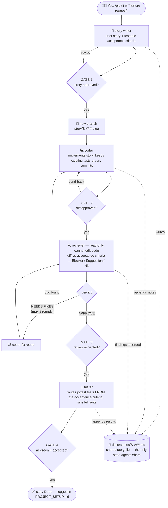

# Customer Feedback & Churn Prediction — End-to-End ML Project

Two supervised models served as one live web app, covering the **full ML lifecycle**
twice over:

- **Phase 1 — Sentiment analysis:** classify feedback as positive / negative / neutral
  (30,000 real Amazon product reviews, TF-IDF + Logistic Regression).
- **Phase 2 — Churn prediction:** predict the **probability** a customer churns
  (7,043 real telecom customers, calibrated Logistic Regression with a cost-based
  decision threshold).

Both phases follow the same discipline: real public data → explore → clean → compare
several models honestly → diagnose → tune → serve via FastAPI + a web frontend →
test-gated CI/CD deployment to Azure App Service.

> 🔗 **Live demo:** https://feedback-sentiment-api.azurewebsites.net/ — check a feedback
> sentence's sentiment, then adjust a customer profile and watch their churn risk move.
> *(Prototype hosting — the first request after a deploy may take a few seconds while the
> models train on startup.)*

Full history and decisions: [`PROJECT_SETUP.md`](PROJECT_SETUP.md).

---

## Data

| Dataset | Rows | What it is |
|---------|-----:|------------|
| `data/feedback_reviews.csv` | **30,000** | Real Amazon product reviews (English subset of the multilingual Amazon reviews corpus, Apache-2.0), balanced 10k per class. Star ratings mapped to sentiment: 1–2★ → negative, 3★ → neutral, 4–5★ → positive. **Trains the sentiment model.** |
| `data/telco_churn.csv` | **7,043** | IBM Telco Customer Churn — the standard public churn benchmark. Real telecom customers, 19 features, 26.5% churn. **Trains the churn model.** |
| `data/feedback_sample.csv` | 149 | The original hand-built sample used to learn the pipeline mechanics in the notebook. Kept as project history. |

Scaling from 149 synthetic rows to 30k real, messy reviews changed the conclusions — see
the lessons below.

## Architecture

```
data/feedback_reviews.csv (30k reviews)      data/telco_churn.csv (7k customers)
        │                                            │
        ▼                                            ▼
src/train.py ── TF-IDF + LogReg              src/churn.py ── ColumnTransformer +
        │       sentiment_model.joblib               │        calibrated LogReg
        │       (regenerated, not committed)         │        churn_model.joblib + threshold
        └──────────────────┬─────────────────────────┘
                           ▼
                src/app.py (FastAPI)
   ├── GET  /health           liveness check
   ├── GET  /version          app version + which models are loaded
   ├── POST /predict          text → {"sentiment", "is_positive", "confidence"}
   ├── POST /predict-churn    customer → {"churn_probability", "will_churn", "risk_band"}
   └── GET  /                 static/index.html — both forms, one page
                           │
                           ▼
GitHub Actions (.github/workflows/deploy.yml)
   push to master ──► pytest gate ──► deploy to Azure App Service (Linux, gunicorn+uvicorn)
```

Design choices worth noting:

- **Swappable models.** Every classifier is wrapped in the same `Pipeline([TF-IDF, clf])`
  interface, so models are compared apples-to-apples and swapping one is a one-line change.
- **No data leakage.** TF-IDF is fit inside the pipeline on training data only.
- **Self-training deploys.** The model artifact is gitignored; a fresh server trains it on
  startup (~5 s on 30k reviews), so no binary ships through git or CI.
- **Negations are kept.** TF-IDF does *not* strip English stopwords — "no"/"not" are
  stopwords, and removing them measurably hurt sentiment accuracy (see lessons).
- **The probability is the product (churn).** The churn model is wrapped in
  `CalibratedClassifierCV` so "70% risk" means ~70% actually churn, and the yes/no
  threshold (0.10) was derived from retention-offer vs lost-customer costs — it ships
  *inside the model bundle*, versioned with the model, not hardcoded in the API.
- **Predictions are logged.** Each churn prediction emits one structured JSON log line —
  the seed of a monitoring story (drift, volume) with zero new dependencies.

## Results — Phase 1: sentiment

Evaluated on a **held-out test set of 6,000 reviews** (stratified 80/20 split):

| Model | Accuracy | Macro-F1 |
|-------|---------:|---------:|
| **Logistic Regression (`class_weight="balanced"`, stopwords kept)** | **0.649** | **0.650** |
| Logistic Regression (stopwords stripped) | 0.617 | 0.615 |
| Linear SVC | 0.591 | 0.588 |
| Random Forest | 0.593 | 0.585 |
| Multinomial Naive Bayes (`alpha=0.1`) | 0.577 | 0.578 |

Per-class (winner): negative **0.677** F1, neutral **0.540**, positive **0.733**. Neutral is
by far the hardest class — 3-star reviews are genuinely mixed ("good but…") even for humans.

Sample predictions from the deployed model:

| Feedback | Prediction | Confidence |
|----------|-----------|-----------:|
| "Absolutely love this, it works perfectly and support was great!" | positive | 100% |
| "The item arrived broken and no one will respond to my emails." | negative | 81% |
| "It is fine, does the job but nothing special." | neutral | 73% |
| "The package was delivered on Tuesday as scheduled." | negative (wrong — should be neutral) | 46% |

That last row is left in deliberately: delivery-focused reviews skew negative in the
training data, so purely factual logistics statements get pulled toward negative — a known
failure mode, at low confidence. Full analysis in
[`docs/phase1_walkthrough.md`](docs/phase1_walkthrough.md).

## Results — Phase 2: churn

Evaluated on a **held-out test set of 1,409 customers** (stratified 80/20 split):

| Model | ROC-AUC | PR-AUC | Brier ↓ |
|-------|--------:|-------:|--------:|
| **Logistic Regression (balanced) → sigmoid-calibrated** | **0.842** | 0.633 | **0.138** |
| HistGradientBoosting | 0.833 | 0.638 | 0.142 |
| Random Forest | 0.822 | 0.602 | 0.156 |

The production-shaped details (full analysis in
[`docs/phase2_walkthrough.md`](docs/phase2_walkthrough.md)):

- **Calibration mattered:** the raw balanced Logistic Regression ranked best but had the
  *worst* probability honesty (Brier 0.169) — calibration fixed it (0.138) without
  touching the ranking.
- **The threshold is a business decision:** with a ~$50 retention offer vs a ~$500 lost
  customer, the cost-optimal flag threshold is **0.10** (exactly the 50/500 cost ratio) —
  not the conventional 0.5.
- **Explainable drivers:** fiber-optic internet (+0.72) and month-to-month contracts
  (+0.66) push churn; long tenure (−1.14) and two-year contracts (−0.77) protect.
- **Demo contrast:** a 2-month fiber/month-to-month customer scores **74.3%** churn risk;
  a 68-month DSL/two-year customer scores **0.6%**.

### What building this actually taught me

1. **Explore before modelling.** Basic EDA on the first sample caught a missing label and a
   duplicate row before they polluted training.
2. **Trust the right ruler.** At 149 rows, a single 38-row test split made the models look
   broken (~0.47–0.61 F1); 5-fold cross-validation revealed their true level. At 30k rows,
   a 6,000-review held-out set is statistically sound on its own.
3. **Small-data winners don't survive scale.** Tuned Naive Bayes won on 149 rows (~0.74 CV
   macro-F1) — on 30k real reviews it came **last**, and Logistic Regression won. Model
   rankings are dataset-dependent; re-benchmark when the data changes.
4. **Domain match matters.** A first attempt used 60k labeled tweets: benchmark scores
   looked fine, but the model called *"The item arrived broken and no one will respond to my
   emails"* **neutral** — tweet negativity (politics, insults) doesn't transfer to product
   complaints. Switching to Amazon reviews fixed it.
5. **Don't strip negations.** Removing English stopwords deletes "no"/"not" and cost
   0.035 macro-F1. Preprocessing defaults are not free.
6. **`class_weight="balanced"` breaks probability honesty** even while it helps ranking —
   the churn leader had the best ROC-AUC and the worst Brier score until calibration.
   Never show an uncalibrated percentage to a human.
7. **0.5 is a convention, not a decision.** The churn flag threshold came from a cost
   model and ships versioned inside the model bundle.

## Quickstart

```bash
python -m venv .venv && source .venv/bin/activate
pip install -r requirements.txt
uvicorn src.app:app --reload        # open http://127.0.0.1:8000
```

Both models train automatically on first startup (a few seconds each). To regenerate
them explicitly:

```bash
python -m src.train    # sentiment model
python -m src.churn    # churn model
```

Try the APIs directly:

```bash
curl -X POST http://127.0.0.1:8000/predict \
  -H "Content-Type: application/json" \
  -d '{"text": "Support was quick and the product works great"}'
# → {"sentiment":"positive","is_positive":true,"confidence":0.9...}

curl -X POST http://127.0.0.1:8000/predict-churn \
  -H "Content-Type: application/json" \
  -d '{"gender":"Female","SeniorCitizen":0,"Partner":"No","Dependents":"No",
       "tenure":2,"PhoneService":"Yes","MultipleLines":"No",
       "InternetService":"Fiber optic","OnlineSecurity":"No","OnlineBackup":"No",
       "DeviceProtection":"No","TechSupport":"No","StreamingTV":"Yes",
       "StreamingMovies":"Yes","Contract":"Month-to-month","PaperlessBilling":"Yes",
       "PaymentMethod":"Electronic check","MonthlyCharges":95.0,"TotalCharges":190.0}'
# → {"churn_probability":0.74...,"will_churn":true,"risk_band":"high"}
```

Interactive API docs (FastAPI auto-generated): http://127.0.0.1:8000/docs

Run the tests:

```bash
pytest
```

Explore the research notebooks:

```bash
jupyter notebook notebooks/01_sentiment_prototype.ipynb   # Phase 1 (sentiment)
jupyter notebook notebooks/02_churn_prototype.ipynb       # Phase 2 (churn)
```

## Project structure

```
data/       feedback_reviews.csv — 30k Amazon reviews (sentiment training data)
            telco_churn.csv — 7k IBM Telco customers (churn training data)
            feedback_sample.csv — original 149-row learning sample
notebooks/  01_sentiment_prototype.ipynb — Phase 1 research pipeline
            02_churn_prototype.ipynb — Phase 2 research pipeline
src/        preprocessing.py, model.py, train.py (sentiment) · churn.py (churn) ·
            app.py (FastAPI serving both)
static/     index.html — single-page frontend: sentiment + churn forms
tests/      pytest suite: preprocessing, sentiment model, API, churn pipeline
docs/       phase1_walkthrough.md, phase2_walkthrough.md, DEPLOYMENT.md (Azure runbook)
.github/    workflows/deploy.yml — test-gated deploy to Azure on push to master
```

## Development workflow — multi-agent pipeline

New features are built through a four-agent Claude Code workflow (`/pipeline "<feature request>"`):
a **story-writer** turns the request into a user story with testable acceptance criteria, a
**coder** implements it on its own branch, a read-only **reviewer** checks the diff against
those criteria, and a **tester** writes pytest tests *from the criteria, not the code*. A
human approval gate sits after every stage, and all agents hand off through a shared story
file in `docs/stories/` (agents have isolated contexts — the file is the only shared state).



The agent definitions live in `.claude/agents/` (tool restrictions enforce the roles — the
reviewer physically has no edit tools) and the orchestrator in `.claude/skills/pipeline/`.
A plain-language walkthrough is in
[`docs/learn/multi-agent-pipeline.md`](docs/learn/multi-agent-pipeline.md); design details in
[`PROJECT_SETUP.md`](PROJECT_SETUP.md) §8.6.

## Two-minute demo

1. Open the live URL (or `uvicorn src.app:app --reload` locally).
2. Paste *"The item arrived broken and no one will respond to my emails"* into the
   sentiment form → **negative, ~88%**.
3. Scroll to the churn form (pre-filled with a high-risk profile) → **~74% churn risk,
   HIGH — flag for retention**.
4. Switch Contract to "Two year", raise tenure to 60 → watch the risk collapse to
   single digits.

Why the design looks the way it does — the five decisions worth asking about:

1. **The churn probability is calibrated** — `class_weight="balanced"` gave the best
   ranking but dishonest percentages (worst Brier score); `CalibratedClassifierCV`
   fixed the probabilities without touching the ranking.
2. **The flag threshold is 0.10, not 0.5** — derived from a $50 retention offer vs a
   $500 lost customer (the optimum is exactly the cost ratio), and versioned *inside*
   the model bundle.
3. **The model is explainable** — coefficients answer "why is this customer flagged?":
   fiber-optic internet and month-to-month contracts push churn; tenure and two-year
   contracts protect.
4. **One platform, two models** — a single FastAPI app serves both, models self-train
   on cold start (no binaries in git/CI), and a pytest gate fronts every deploy.
5. **Rankings flip with data** — the Phase 1 winner on 149 rows (Naive Bayes) came last
   on 30k real reviews; every model choice here was re-benchmarked, not defaulted.

## Tech stack

Python · pandas · scikit-learn · FastAPI · uvicorn/gunicorn · pytest · joblib ·
GitHub Actions · Azure App Service · Jupyter/matplotlib/seaborn (research)

## Roadmap to production

This is deliberately a prototype. The gaps I'd close to make it production-grade, roughly in
order of impact:

1. **Stronger baselines.** ~0.65 macro-F1 is a solid linear-model result on 3-class reviews,
   but a fine-tuned transformer (e.g. DistilBERT) or an LLM zero-shot classifier should beat
   it — benchmark them on the same held-out protocol.
2. **Better neutral handling.** Neutral F1 (0.54) drags the average; options include
   ordinal-aware labeling from star ratings, more granular classes, or calibrated abstention
   on low-confidence predictions.
3. **Experiment tracking & model registry.** MLflow for runs, params, metrics, and versioned
   model artifacts instead of a single joblib file.
4. **Serving hardening.** Rate limiting, auth, input-size limits, structured error
   handling; calibrate the sentiment confidences the way the churn probabilities already
   are.
5. **Monitoring.** Churn predictions already emit structured log lines — next is shipping
   them somewhere queryable, tracking probability/class drift, alerting on degradation,
   and a labeled-feedback loop for retraining.
6. **Link the phases.** Use each customer's feedback sentiment as a churn feature — needs
   a real joined dataset (feedback + outcomes for the same customers); a fabricated link
   would undo the real-data credibility, so it waits for real data.
7. **Threshold sensitivity.** The 0.10 churn flag threshold assumes a 10:1 cost ratio;
   in production you'd re-derive it from measured retention economics and A/B-test it.
